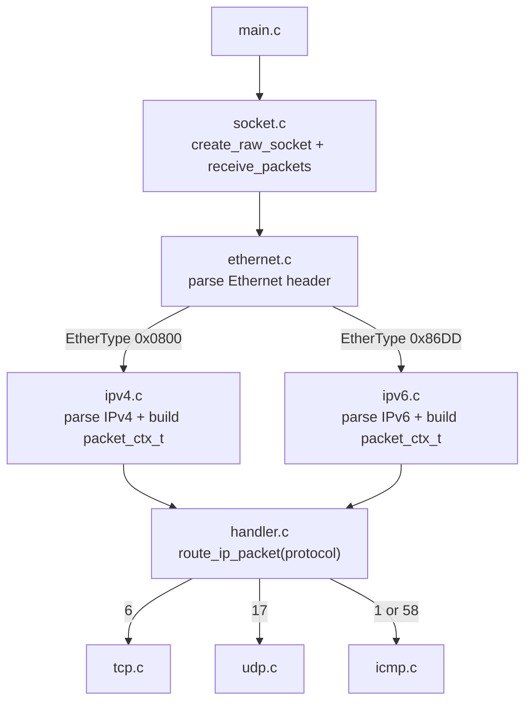

# Linux Packet Sniffer (Project 2)

## Purpose
This project is a C-based Linux packet sniffer built for protocol-learning experiments.

The implemented goals are:
- Capture raw Ethernet frames using an AF_PACKET socket
- Parse Ethernet, IPv4, and IPv6 headers
- Route packets by protocol number to TCP, UDP, and ICMP handlers
- Print useful packet details while protecting against truncated-header reads

This is a stopping point for the current experiment before deep protocol decoding.

## Architecture Diagram

## Project Navigation

### Root
- Makefile: build, run, and clean targets
- README.md: project overview and navigation

### Source Code
- src/main.c: entry point; starts socket capture loop
- src/socket.c: raw socket creation, bind, recvfrom loop, SIGINT stop
- src/ethernet.c: Ethernet header parse and EtherType routing
- src/ipv4.c: IPv4 parse, validation, packet context for handlers
- src/ipv6.c: IPv6 parse, validation, packet context for handlers
- src/handler.c: O(1) protocol dispatch table
- src/tcp.c: basic TCP field parsing
- src/udp.c: basic UDP field parsing
- src/icmp.c: ICMP/ICMPv6 field parsing and message display

### Header Files
- include/socket.h: socket lifecycle API
- include/ethernet.h: Ethernet parser API
- include/ipv4.h: IPv4 parser API
- include/ipv6.h: IPv6 parser API
- include/handler.h: protocol constants, packet_ctx_t, router API
- include/tcp.h: TCP handler API
- include/udp.h: UDP handler API
- include/icmp.h: ICMP handler API

### Documentation
- docs/design_notes.md: socket configuration, parser design, and experiment scope
- docs/header_layouts.md: header files used and protocol header layouts

## Build And Run

Build:
- make

Run (requires root for raw socket):
- make run

Clean:
- make clean

## Current Status
- Raw capture is functional on Linux
- Ethernet -> IPv4/IPv6 -> TCP/UDP/ICMP routing is functional
- ICMP and ICMPv6 are both routed through the ICMP handler
- Basic header-level parsing is implemented with safety checks

## Notes
- This project currently emphasizes parsing flow and visibility, not full protocol compliance.
- Future work can extend deeper parsing (IPv6 extensions, TCP options, richer ICMP decoding, and flow tracking).
